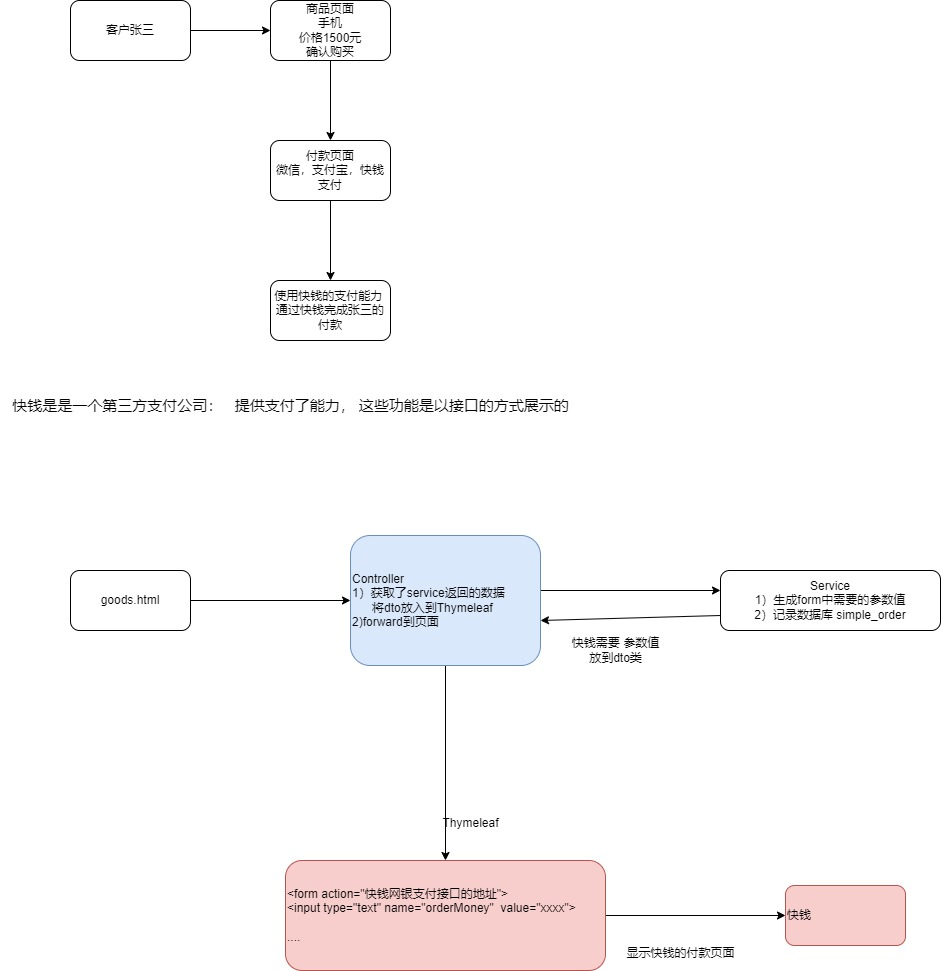
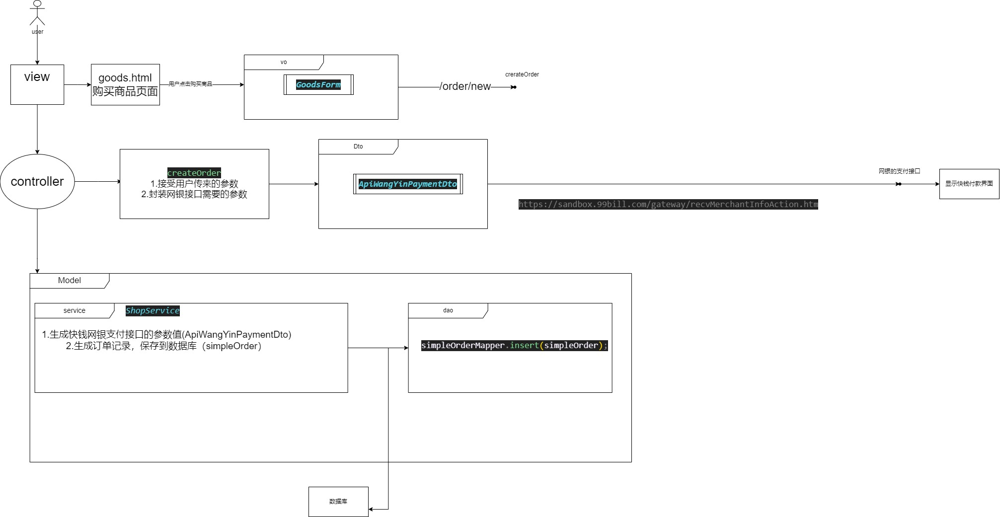
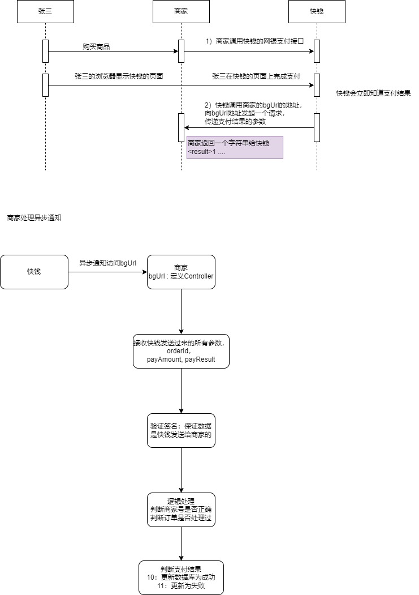
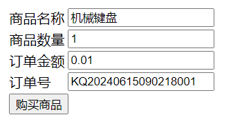

# 快钱支付示例项目

- 支付接口







- 异步通知结果(测试url:http://localhost:8080/shop/receive/notify?orderId=KQ20240615090218001&payResult=10)



Simple-Shop商城项目 ： 实现快钱支付基本功能。  调用支付接口， 能获取异步通知即可

首先阅读快钱接口文档：

https://open.99bill.com/menu!access.do?menuClass=1&mid=1&pid=1

## 1.1 创建MySQL库

库名称simpleshop

表simple-order（购买订单表）

```sql
CREATE TABLE `simple_order` (
 `id` int(11) NOT NULL AUTO_INCREMENT,
 `uid` int(11) NOT NULL COMMENT '用户id',
 `order_no` varchar(50) CHARACTER SET utf8 COLLATE utf8_general_ci NOT NULL COMMENT '订单号',
 `status` int(11) NOT NULL COMMENT '订单状态（0生成，1付款完成，2订单超时，3付款失败）',
 `pay_money` decimal(11, 2) NOT NULL DEFAULT 0.00 COMMENT '订单支付金额',
 `pay_time` datetime NOT NULL COMMENT '支付时间',
 `remark` varchar(50) CHARACTER SET utf8 COLLATE utf8_general_ci NOT NULL COMMENT '订单备注',
 `goods_repl_id` varchar(11) CHARACTER SET utf8 COLLATE utf8_general_ci NOT NULL DEFAULT '0' COMMENT '订单关联商品的id',
 PRIMARY KEY (`id`) USING BTREE
)
```

## 1.2 Spring Boot Web项目

创建 Spring Boot  Web项目 ，Spring Boot版本选择最新的。依赖如下：

- Lombok
- Spring Web
- Thymeleaf
- MyBatis-Plus
- MySQL Driver

### 1.2.1 生成的实体

MyBatisX插件生成simple-order表的实体和mapper等

SimpleOrder实体

```java
@TableName(value ="simple_order")
@Data
public class SimpleOrder implements Serializable {
    @TableId(value = "id", type = IdType.AUTO)
    private Integer id;

    /**
     * 用户id
     */
    @TableField(value = "uid")
    private Integer uid;

    /**
     * 订单号
     */
    @TableField(value = "order_no")
    private String orderNo;

    /**
     * 订单状态（0生成，1付款完成，2订单超时，3付款失败）
     */
    @TableField(value = "status")
    private Integer status;

    /**
     * 订单支付金额
     */
    @TableField(value = "pay_money")
    private BigDecimal payMoney;

    /**
     * 支付时间
     */
    @TableField(value = "pay_time")
    private Date payTime;

    /**
     * 订单备注
     */
    @TableField(value = "remark")
    private String remark;

    /**
     * 订单关联商品的id
     */
    @TableField(value = "goods_repl_id")
    private String goodsReplId;

    @TableField(exist = false)
    private static final long serialVersionUID = 1L;
}
```


Mapper接口：

```java
public interface SimpleOrderMapper extends BaseMapper<SimpleOrder> {
    /**
     * 根据订单id查询订单，在执行查询时锁定行,以防止其他事务对这些行进行更改
     * @param orderId   订单id
     * @return 订单数据
     */
    SimpleOrder selectByOrderIdForUpdate(String orderId);
}
```


Mapper XML

```xml
<?xml version="1.0" encoding="UTF-8"?>
<!DOCTYPE mapper
        PUBLIC "-//mybatis.org//DTD Mapper 3.0//EN"
        "http://mybatis.org/dtd/mybatis-3-mapper.dtd">
<mapper namespace="com.romaneekang.project.mapper.SimpleOrderMapper">

    <resultMap id="BaseResultMap" type="com.romaneekang.project.pojo.SimpleOrder">
            <id property="id" column="id" jdbcType="INTEGER"/>
            <result property="uid" column="uid" jdbcType="INTEGER"/>
            <result property="orderNo" column="order_no" jdbcType="VARCHAR"/>
            <result property="status" column="status" jdbcType="INTEGER"/>
            <result property="payMoney" column="pay_money" jdbcType="DECIMAL"/>
            <result property="payTime" column="pay_time" jdbcType="TIMESTAMP"/>
            <result property="remark" column="remark" jdbcType="VARCHAR"/>
            <result property="goodsReplId" column="goods_repl_id" jdbcType="VARCHAR"/>
    </resultMap>

    <sql id="Base_Column_List">
        id,uid,order_no,
        status,pay_money,pay_time,
        remark,goods_repl_id
    </sql>
<!--
    for update: 给记录上锁，是mysql的数据库锁，排他锁
    排他锁含义：当前事务锁定记录，这个记录的数据在当前事务没有完成之前，不能被修改或者删除
    锁类型：
    1.行级别锁:只锁定一行，其他行数据库任何事务都可以修改、删除
        成立条件:where部分 需要使用主键或唯一索引作为条件
    2.表级别锁：锁定表中所有行，直到事务结束
-->
    <select id="selectByOrderIdForUpdate" resultMap="BaseResultMap">
        select
        <include refid="Base_Column_List"/>
        from simple_order
        where order_no = #{orderId}
        for update
    </select>
</mapper>
```

### 1.2.2 配置数据源

新建application.yml

```yml
# 连接数据库
spring:
  datasource:
    driver-class-name: com.mysql.cj.jdbc.Driver
    url: jdbc:mysql:///mp
    username: root
    password: 2000324
mybatis-plus:
  configuration:
    log-impl: org.apache.ibatis.logging.stdout.StdOutImpl
  mapper-locations: classpath:/mapper/**/*.xml
server:
  port: 8080
  servlet:
    context-path: /shop
```


启动类@MapperScan()

```java
@SpringBootApplication
@MapperScan("com.romaneekang.project.mapper")
public class SimpleShopApplication {

    public static void main(String[] args) {
        SpringApplication.run(SimpleShopApplication.class, args);
    }

}
```

### 1.2.3 创建商品页面

购买商品页面：

	

static/目录下创建goods.html

```html
<!DOCTYPE html>
<html lang="en">
<head>
    <meta charset="UTF-8">
    <title>购买商品</title>
</head>
<body>
<form action="/shop/order/new" method="get" target="_blank">
    <table>
        <tr>
            <td>商品名称</td>
            <td>
                <input type="text" name="productName" value="机械键盘">
            </td>
        </tr>
        <tr>
            <td>商品数量</td>
            <td>
                <input type="text" name="productNum" value="1">
            </td>
        </tr>
        <tr>
            <td>订单金额</td>
            <td>
                <input type="text" name="orderMoney" value="0.01">
            </td>
        </tr>
        <tr>
            <td>订单号</td>
            <td>
                <input type="text" name="orderId" value="KQ20240615090218001">
            </td>
        </tr>
        <tr>
            <td colspan="2">
                <input type="submit" value="购买商品">
            </td>
        </tr>
        <input type="hidden" name="payerId" value="5691">
        <input type="hidden" name="payerConcat" value="18335953515">
        <input type="hidden" name="productId" value="P00001">
    </table>
</form>
</body>
</html>
```

### 1.2.4 创建Controller

controller创建支付方法，接收支付金额，调用service支付方法。

controller创建异步通知方法，接收快钱的异步通知。  接收到通知输出进行即可。 简单判断支付结果。


### 1.2.5 创建支付的Service

支付方法： 调用快钱【网银支付接口】，存储支付记录

异步通知处理方法： 处理异步通知


接收异步通知的类

```java
public class NoticeForm {
    private String merchantAcctId;
    private String version;
    private String language;
    private String signType;
    private String payType;
    private String bankId;
    private String orderId;
    private String orderTime;
    private String orderAmount;
    private String bindCard;
    private String bindMobile;
    private String dealId;
    private String bankDealId;
    private String dealTime;
    private String payAmount;
    private String fee;
    private String ext1;
    private String ext2;
    private String payResult;
    private String aggregatePay;
    private String errCode;
    private String signMsg;
}
```


### 1.2.6 创建支付的Mapper

通过Mapper创建支付记录，异步通知更新订单状态（支付成功，失败）


## 1. 3 快钱支付Base64编码库

Maven依赖

```xml
  <dependency>
        <groupId>commons-codec</groupId>
        <artifactId>commons-codec</artifactId>
        <version>1.16.0</version>
  </dependency>
```


参考代码

```java
import org.apache.commons.codec.binary.Base64
    
//编码
Base64 encode = new Base64();
base64 =  encode.encodeAsString(signature.sign());

//解码
Base64 encode = new Base64();
boolean flag = signature.verify(decoder.decode(msg.getBytes()));
```

## 1.4 异步通知测试url

http://localhost:8080/shop/receive/notify?orderId=KQ20240615090218001&payResult=10

